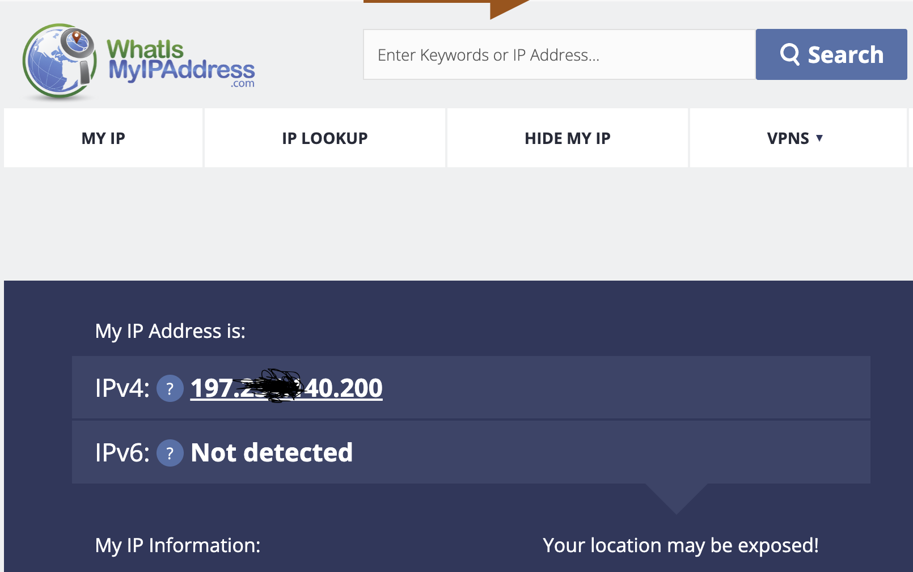
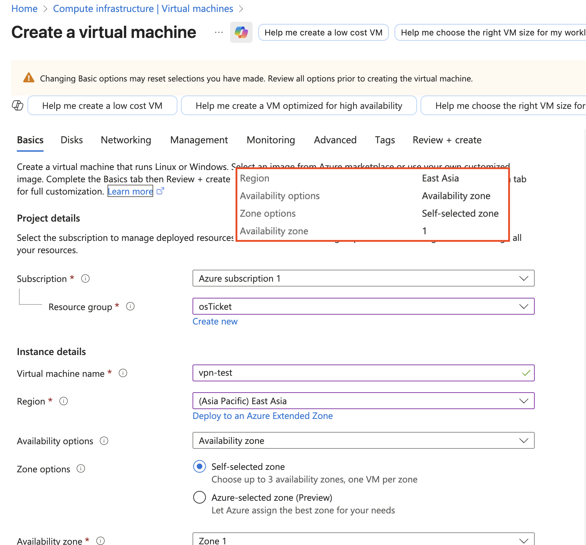
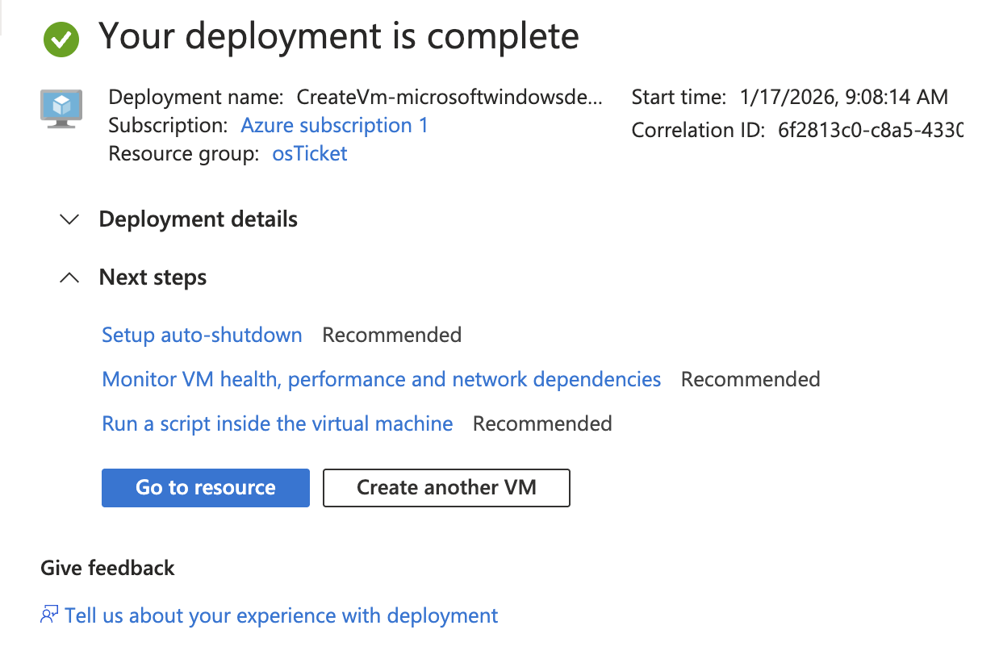
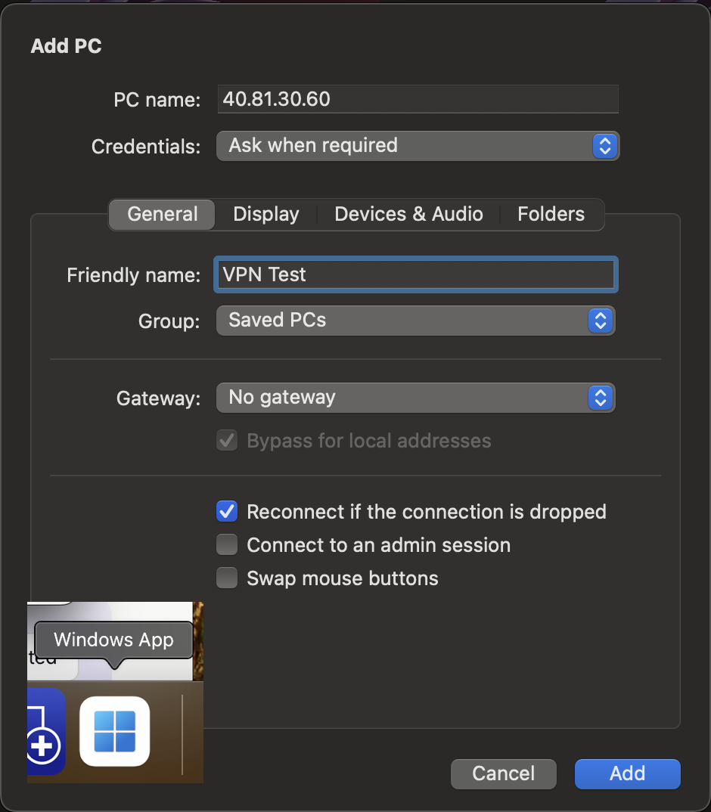
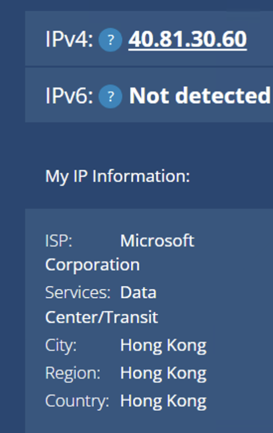
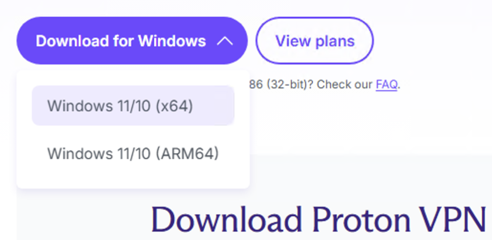
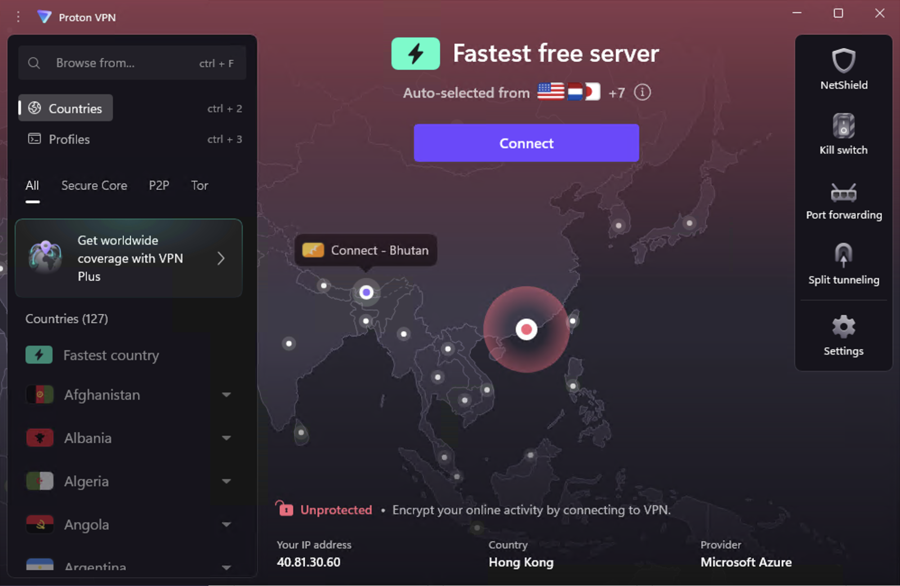
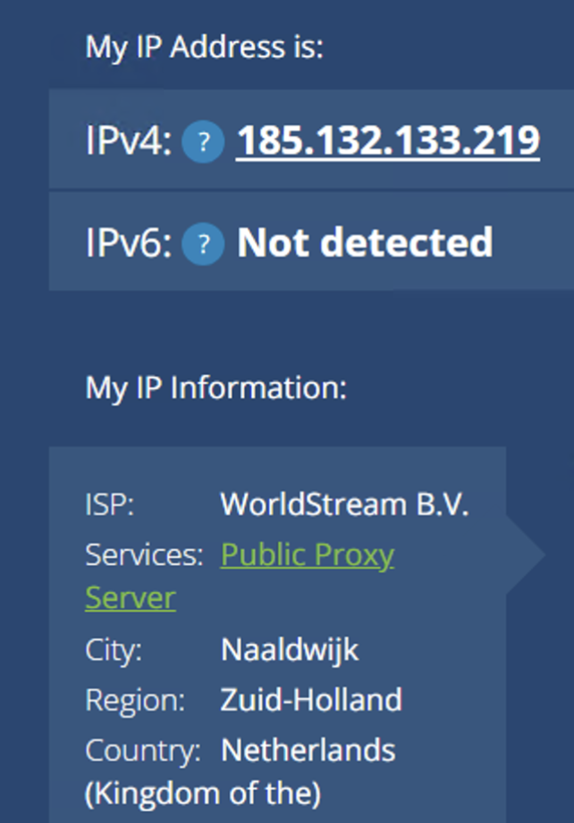
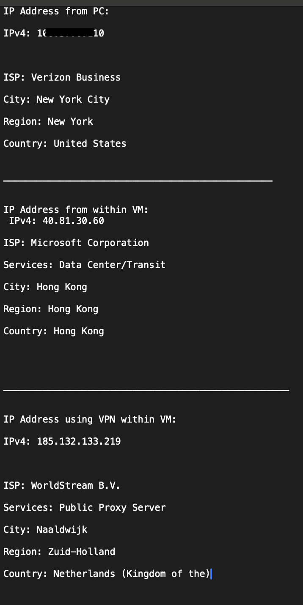

# Virtual Private Network (VPN) Lab

## 📌 Project Overview

This lab demonstrates the use of a **Virtual Private Network (VPN)** to mask geographic location and alter IP-based access by routing traffic through encrypted tunnels.  

The lab validates VPN behavior by comparing IP addresses and geolocation data **before VM creation, after VM deployment, and after VPN activation**.

---

## 🛠 Environment & Tools Used

- Azure Cloud Virtual Machine  
- Proton VPN  
- Windows 10  
- Microsoft Remote Desktop  
- WhatIsMyIPAddress.com  

---

## 🎯 Skills Demonstrated

- VPN configuration and validation  
- IP address and geolocation analysis  
- Virtual machine deployment and access  
- Secure remote connectivity concepts  
- Network privacy awareness  

---

# 🚀 Lab Steps

---

## 1️⃣ Baseline IP Address and Geolocation Check

The public IPv4 address and geographic location of the local machine are identified using an IP lookup service.  

This establishes a **baseline** before any virtual infrastructure or VPN usage.

📸 Screenshot:  

  
*Original IP and geolocation of the local machine.*

---

## 2️⃣ Create Virtual Machine in Alternate Geographic Region

A virtual machine is deployed in the **East Asia region** using Azure.  

This selection determines the initial geolocation associated with the VM’s **public IP address**.

📸 Screenshots:  

  
*Azure VM creation interface.*

  
*Region selection and final deployment confirmation.*

---

## 3️⃣ Access Virtual Machine via Remote Desktop

The VM is accessed using **Microsoft Remote Desktop** by connecting to its public IP address with administrator credentials.

📸 Screenshots:  

  
*Remote Desktop connection setup.*

  
*Successful login to Azure VM.*

---

## 4️⃣ Verify VM IP Address and Location

The VM’s public IP address is checked using an IP lookup service, confirming the **geolocation corresponds to Hong Kong** based on the selected Azure region.

📸 Screenshot:  

  
*IP address and geolocation confirmation for the VM.*

---

## 5️⃣ Install and Connect to VPN Client

Proton VPN is downloaded and installed on the virtual machine.  

A VPN server located in a different country is selected, and the VPN tunnel is established.

📸 Screenshots:  

  
*Downloading and installing Proton VPN.*

  
*Connecting to a VPN server in the Netherlands.*

---

## 6️⃣ Validate VPN IP Address and Geolocation Change

After VPN activation, the public IP address is checked again.  

The geolocation now reflects the **VPN server location**, confirming successful traffic tunneling.

📸 Screenshot:  

  
*IP address and geolocation updated to VPN server location.*

---

## 7️⃣ Validate Geolocation Impact Using Streaming Services

Netflix is accessed to demonstrate how **content availability and regional access** are influenced by IP-based geolocation changes introduced by the VPN.

📸 Screenshot:  

  
*Content availability reflects VPN server location.*

---

## 8️⃣ Summary of IP Address and Geolocation Transitions

Comparison of three distinct network states observed during the lab:

1. **Local machine IP and location** – Original public IP and location before any virtualization or VPN usage.  
2. **Azure VM IP and location** – Shows how VM deployment in a different region changes apparent network location.  
3. **VPN-protected IP and location** – Confirms VPN traffic is routed through an external endpoint, masking the original IP and location.  

📸 Screenshot:  

  
*Summary comparison of network states and geolocation transitions.*

---

# 📊 Lab Outcome

- VPN successfully masked geographic location and altered IP-based access  
- Azure VM deployment tested geolocation changes prior to VPN activation  
- Remote Desktop access confirmed connectivity and security  
- Streaming service access validated IP-based geolocation impact  

---

# 📚 Key Takeaways

- Understanding VPN configuration and secure traffic tunneling  
- IP address and geolocation analysis for network privacy  
- Validating cloud infrastructure deployment impacts on network visibility  
- Practical experience with Azure VMs, Remote Desktop, and VPN tools  

---

# 📌 Future Improvements

- Test multiple VPN providers and server locations  
- Implement automated geolocation testing scripts  
- Combine VPN with firewall and network monitoring for advanced security labs  
- Analyze latency and performance impact of VPN connections  

---

# 🏁 Conclusion

This lab demonstrates a **practical VPN workflow**, showing how virtual machines and VPNs interact to control **IP-based access and geolocation**.  

It provides hands-on experience in **network privacy, secure remote connectivity, and cloud deployment validation**.

---

## 👤 Author

**Gokah William**  
IT & Networking Professional  
Focused on VPNs, Cloud Infrastructure, and Network Privacy
